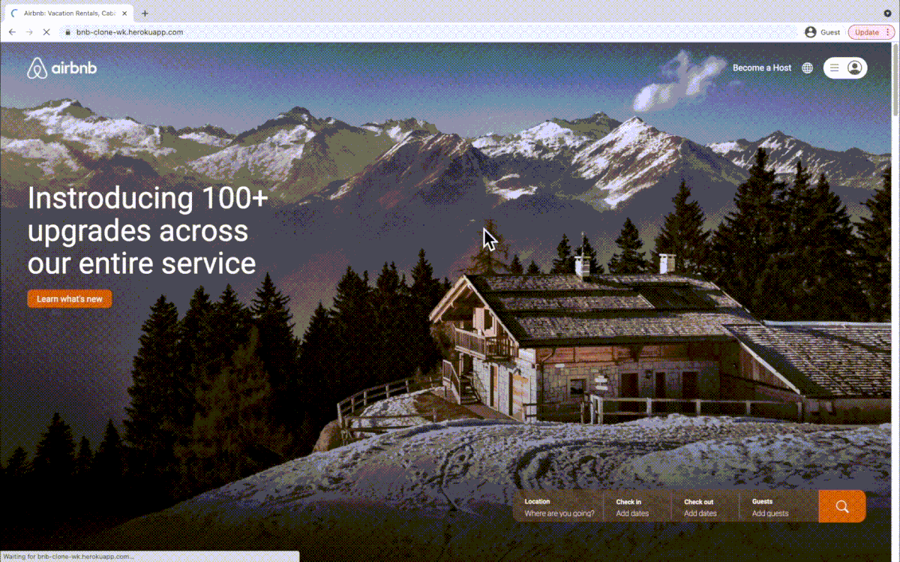
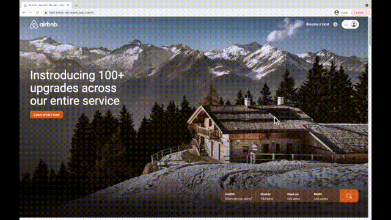
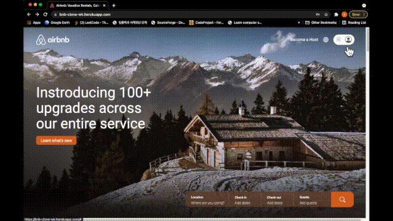

# Airbnb Clone

Airbnb clone full stack website using Node.js, MongoDB, Heroku. Used handlebars to template front-end and a combination of pure CSS and Bootstrap. User input validation, user authentication, admin/user authorization, data object CRUD operations are implemented.

-   http://bnb-clone-wk.herokuapp.com/
-   <a href="https://www.youtube.com/watch?v=iZcfMy2hNsw
    " target="_blank">Video Demo Link</a>

## Main Page

## Responsive Design

## Searching rooms

## Admin Post/Update/Delete a Room

## Sign-up & Data validation

